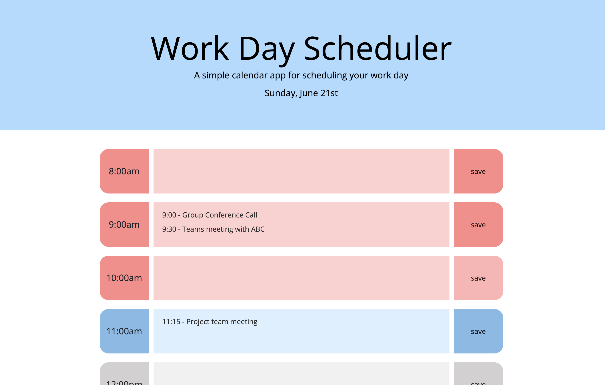

# Day-Planner

A simple calendar application that allows the user to save events for each hour of the work day.

The interface tells the user the current date in the page header, and has an hour-block for each hour of the work day that is color-coded based on the user's current hour. 

- If the hour has passed, the hour-block has a red theme. 
- If it is the current hour, the hour-block has a blue theme. 
- If the hour is in the future, the hour-block has a 'blank' theme, represented in grey. 

The user can enter events into the provided text area next to the hour that it would occur. 

If the user hits the save button next to the text area, that event will be saved, and will remain there even when the user refreshes or closes and re-opens the webpage. 

If the user wants to clear an event, they can clear the text area and re-save. 

The web-page resets at midnight.

Preview it here: https://kimcredit.github.io/Day-Planner/
